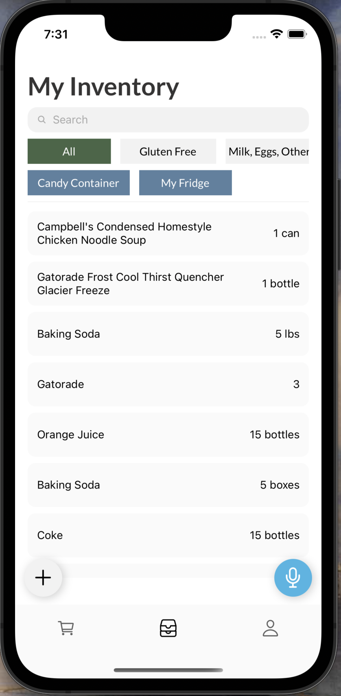
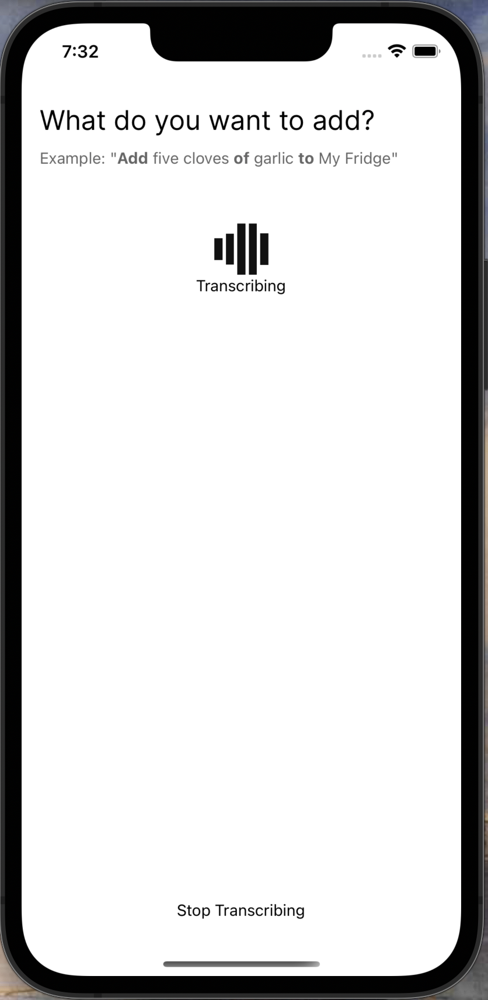
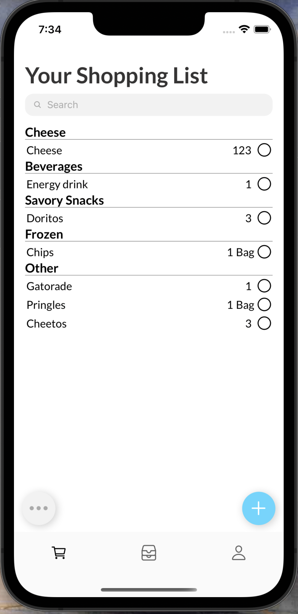

# kitchenwise-mobile

Kitchenwise is an app that helps home cooks manage their inventory. Featuring voice-based item entry, receipt scanning, and slick, simple UI, Kitchenwise makes sure that you will never forget to buy an item from the grocery store or lose track of what's in your fridge.

## Architecture

The app is built with React Native & Expo. We (partially) leverage Firebase for our auth system.

## Setup Instructions

### Prerequisites

- Xcode (this app has only been thoroughly tested on iOS)
  - Download the latest iOS version & iPhone simulator
- Nodejs
- Yarn
  - `npm i -g yarn` to install
- A server URL running the kitchenwise backend
  - We currently provide our own backend url (shhh)

### Instructions

1. Run `yarn` in the project root to install all node dependencies.
2. Since we don't have a complete auth system, go into your mongo database, create a user, and add their user id to defaultUserContext.userId in ./context/user-context.js
   - We currently provide the userId we've been using.
3. Next, run `yarn ios` to start the application.

### For Devs: Testing on a Physical Device

NOTE: This requires access to the Apple Developer team used for this app
First, plug in your iPhone using a USB cable.
Then, open the prebuilt `./ios` folder using Xcode, and switch the build destination from a simulator to the name of your plugged-in device. Once you hit "Run", the developer build will be compiled and downloaded onto your iPhone.

- Xcode will likely prompt you to link your project to an Apple Developer account & team at this stage
  Follow [this guide](https://stackoverflow.com/a/77831486), setting the environment variables based on the USB's newly added ifconfig IPs. You will also need to change the `urls.js` backend URL to that same IP if you're running the server locally.

## Deployment (TestFlight)

NOTE: Requires an Expo account & an Apple Developer account

1. Run `eas build --platform ios` to create an Expo iOS build
2. Then, if successful, run `eas submit -p ios` and select the EAS build for submission to TestFlight.

## Troubleshooting

Most issues come from the iOS build. Simple troubleshooting steps include:

- Ensure packages are installed by running `yarn` in the root folder.
- Within the `./ios` directory, run `npx pod deintegrate` before re-running `yarn ios` in root.
- Deleting `ios/.xcode.env.local` and/or `ios/.xcode.env` has fixed crashes before.
- Deleting `Podfile.lock` often solves issues, especially when updating packages.

## Authors

Stefel Smith  
Victor Sanni  
Syed Hussaini  
Brian Zhang  
Julian George  

## Acknowledgments

We use OpenAI's Whisper model for voice OCR (transcription).

Thanks to Tim for giving us the initial idea to build a VUI for this problem.
